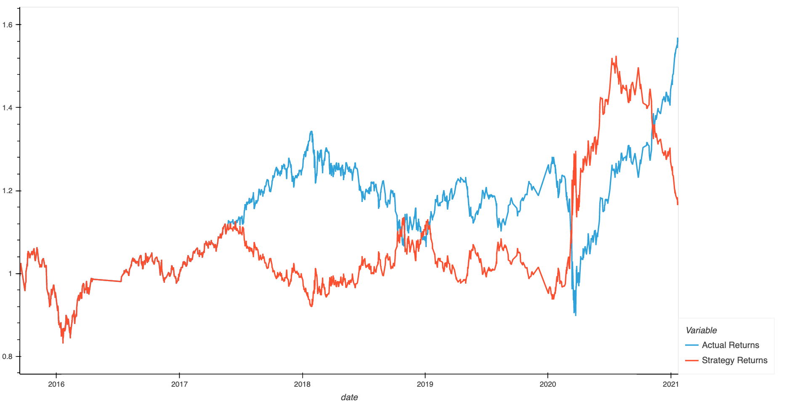

# Module 14

## Instructions
You’ll combine your new algorithmic trading skills with your existing skills in financial Python programming and machine learning to create an algorithmic trading bot that learns and adapts to new data and evolving markets.

In a Jupyter notebook, you’ll do the following:

- Implement an algorithmic trading strategy that uses machine learning to automate the trade decisions.

- Adjust the input parameters to optimize the trading algorithm.

- Train a new machine learning model and compare its performance to that of a baseline model.

## Analysis
####Tune the Baseline Trading Algorithm
***Step 1:** Tune the training algorithm by adjusting the size of the training dataset.
To do so, slice your data into different periods.*
**What impact resulted from increasing or decreasing the training window?**
Increasing the training window to 1 year kept the accuracy in our SVC model to 0.55, increasing it to 5 years it improved it to 0.62. Whilst decreasing it to 1 week had an accuracy of 0.56 (similar to our initial 3 month window)

***Step 2:** Tune the trading algorithm by adjusting the SMA input features.
Adjust one or both of the windows for the algorithm.*
**What impact resulted from increasing or decreasing either or both of the SMA windows?**
With SMA_fast of 4 and SMA_slow of 100 the accuracy was of 0.62.
When the SMA_fast was reduced to 2 and the SMA_slow was reduced to 50, our model's accuracy was reduced to 0.57. Whereas when we used the SMA_fast of 20 and the SMA_slow of 200 the accuracy was reduced to 0.60

***Step 3:** Save a PNG image of the cumulative product of the actual returns vs. the strategy returns.*

####Evaluate a New Machine Learning Classifier
*Save a PNG image of the cumulative product of the actual returns vs. the strategy returns for this updated trading algorithm, and write your conclusions in your README.md file.*

**Did this new model perform better or worse than the provided baseline model?**
The AdaBoost model perfomed better with 16.50% cumulative returns vs 14.30% for the SVC model. On the downside our AdaBoost model performed better, mostly because it was better at predicting the -1 signal with a 0.63 vs 0.15 of our SVC model. The 1 signal was instead better by our AdaBoost model with 0.87 vs 0.39.

**Did this new model perform better or worse than your tuned trading algorithm?**
Our model performed worse with the tunning of 5 years and also by changing the SMA periods.

---

## Installation Guide
1. Clone this project using git with the following command: `git clone git@github.com:galcivar/module_14.git`
2. Install Python you should follow this instructions depending on you OS: https://realpython.com/installing-python/

---

## Usage
You can use this program by opening the file: `machine_learning_trading_bot.ipynb` in the Google Colab.

---

## Contributors
Gabriel Alcivar
[Email](mailto:galcivar@galgomedia.com) - [LinkedIn](https://www.linkedin.com/in/gabriel-alcivar-aa83a710b/) - [GitHub](https://github.com/galcivar/)

---

## MIT License

Copyright (c) [2022] [Gabriel Alcivar]

Permission is hereby granted, free of charge, to any person obtaining a copy
of this software and associated documentation files (the "Software"), to deal
in the Software without restriction, including without limitation the rights
to use, copy, modify, merge, publish, distribute, sublicense, and/or sell
copies of the Software, and to permit persons to whom the Software is
furnished to do so, subject to the following conditions:

The above copyright notice and this permission notice shall be included in all
copies or substantial portions of the Software.

THE SOFTWARE IS PROVIDED "AS IS", WITHOUT WARRANTY OF ANY KIND, EXPRESS OR
IMPLIED, INCLUDING BUT NOT LIMITED TO THE WARRANTIES OF MERCHANTABILITY,
FITNESS FOR A PARTICULAR PURPOSE AND NONINFRINGEMENT. IN NO EVENT SHALL THE
AUTHORS OR COPYRIGHT HOLDERS BE LIABLE FOR ANY CLAIM, DAMAGES OR OTHER
LIABILITY, WHETHER IN AN ACTION OF CONTRACT, TORT OR OTHERWISE, ARISING FROM,
OUT OF OR IN CONNECTION WITH THE SOFTWARE OR THE USE OR OTHER DEALINGS IN THE
SOFTWARE.
